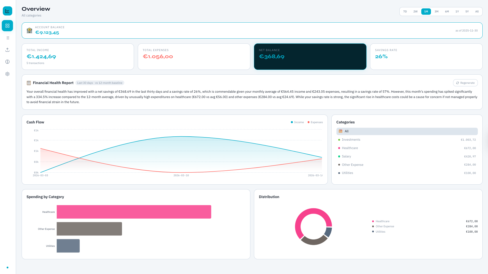
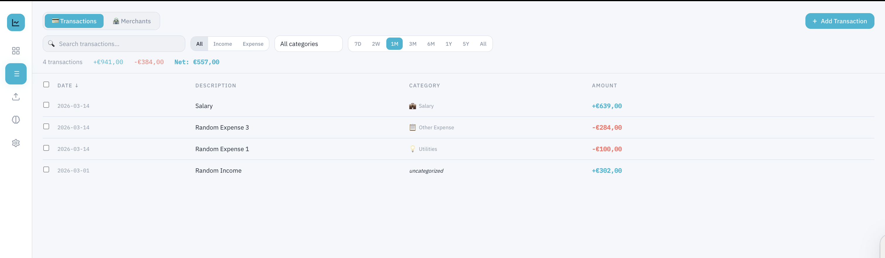
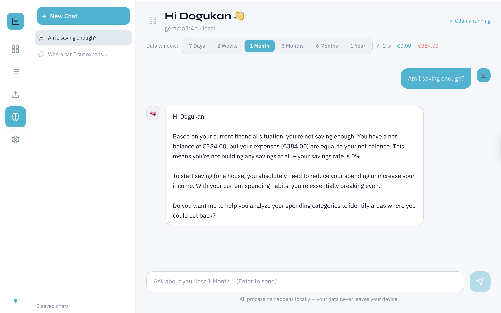

# ⚓ OpenAnchor | The Open Source Financial Planner

> Open-source, privacy-first financial planner with local AI. No cloud. No accounts. No telemetry.

Built with **Electron**, **React**, **SQLite**, and **Ollama** — everything runs on your machine.

---

## Screenshots

### Dashboard

Get a full financial overview at a glance. The dashboard shows your income, expenses, and net balance across any time range — 7 days to 5 years. Interactive area charts track your cash flow over time, while the category breakdown and donut chart reveal exactly where your money is going.

### Transactions

Every transaction in one place. Filter by time range, category, or type — search across all entries instantly. Add, edit, or delete transactions manually, or let the AI importer handle it. Each row shows the date, description, category icon, and amount at a glance.

### AI Assistant

Your personal finance analyst — running entirely on your machine. Powered by Ollama, the AI assistant reads your transaction history and answers questions, spots spending patterns, and gives tailored recommendations. No data ever leaves your device.

---

## Features

- 📄 **Import bank statements** — Upload PDF, CSV, or TXT files; AI extracts transactions automatically
- 🤖 **Local AI extraction** — Uses Ollama models to parse your statements (you choose the model)
- 📊 **Rich dashboard** — Area charts, bar charts, donut charts with time range filtering
- ⏱️ **Flexible time ranges** — 7D / 2W / 1M / 3M / 6M / 1Y / 5Y / All — per category
- 📈 **Trend view** — See cash flow trends across any time period
- 🏷️ **Smart categorization** — 20 built-in categories + unlimited custom ones
- ✏️ **Manual management** — Add, edit, delete transactions
- 🧠 **AI Assistant** — Chat with your financial data, get insights and recommendations
- 🔒 **100% local** — SQLite database, Ollama AI, no internet required after setup

---

## Prerequisites

### 1. Node.js & npm
Download from [nodejs.org](https://nodejs.org) (v18 or newer recommended)

### 2. Ollama (for AI features)
```bash
# macOS
brew install ollama

# Linux
curl -fsSL https://ollama.ai/install.sh | sh

# Windows
# Download from https://ollama.ai/download
```

Then start Ollama and pull a model:
```bash
# Start Ollama server
ollama serve

# Pull models (in a new terminal)
ollama pull llama3.2          # 3b - fast, good for extraction
ollama pull llama3.1:8b       # 8b - great for AI assistant
ollama pull qwen2.5:3b        # 3b - very fast, multilingual
ollama pull mistral:7b        # 7b - good all-rounder
```

**Model recommendations:**
| Task | Low-end hardware | Mid-range | High-end |
|------|-----------------|-----------|----------|
| Extraction | `qwen2.5:3b` | `llama3.2:3b` | `llama3.1:8b` |
| Assistant | `qwen2.5:3b` | `llama3.1:8b` | `llama3.3:70b` |

---

## Installation

```bash
# Clone the repository
git clone https://github.com/your-username/openanchor.git
cd openanchor

# Install dependencies (also rebuilds better-sqlite3 for Electron automatically)
npm install

# Start in development mode
npm run dev
```

---

## Building for Distribution

```bash
# Build for macOS (.dmg)
npm run build:mac

# Build for Windows (.exe)
npm run build:win
```

Output will be in the `dist-electron/` folder.

---

## First-Time Setup

1. **Start the app** — `npm run dev`
2. **Open Settings** (gear icon in sidebar)
3. **Select your AI models:**
   - `Extraction Model` — used to parse bank statements (smaller = faster)
   - `Assistant Model` — used for the AI chat (larger = smarter)
4. **Set your currency**
5. **Import your first bank statement** via the Import tab

---

## How Bank Statement Import Works

1. Click **Import** in the sidebar
2. Upload a PDF, CSV, or TXT bank statement from your bank
3. The app reads the file **locally** — it never leaves your device
4. The text is sent to your **local Ollama model** which extracts transactions
5. Review and edit extracted transactions (fix dates, amounts, assign categories)
6. Click **Import** to save to your local SQLite database

**Supported formats:**
- PDF (most bank statements)
- CSV (many banks offer CSV export)
- TXT (plain text statements)

**Tips for better extraction:**
- Use a capable model (llama3.2 or better)
- Text-based PDFs work best (not scanned images)
- Review all extracted transactions before importing

---

## Data Storage

All data is stored in a local SQLite database:

- **macOS:** `~/Library/Application Support/openanchor/finance.db`
- **Windows:** `%APPDATA%\openanchor\finance.db`
- **Linux:** `~/.config/openanchor/finance.db`

You can back up this file at any time by copying it.

---

## Tech Stack

| Layer | Technology |
|-------|-----------|
| Desktop framework | [Electron](https://electronjs.org) |
| Frontend | [React](https://react.dev) + [Vite](https://vitejs.dev) |
| Styling | [Tailwind CSS](https://tailwindcss.com) |
| Database | [SQLite](https://sqlite.org) via [better-sqlite3](https://github.com/WiseLibs/better-sqlite3) |
| Charts | [Recharts](https://recharts.org) |
| AI runtime | [Ollama](https://ollama.ai) (local, open-source) |
| PDF parsing | [pdf-parse](https://www.npmjs.com/package/pdf-parse) |

---

## Contributing

Pull requests welcome! Key areas for contribution:

- Additional bank statement parsers (custom parsers per bank format)
- More chart types (net worth over time, savings rate trend)
- Budget planning and goals feature
- Receipt scanning (image → text via local OCR)
- Multi-account support
- Export to CSV/Excel

---

## Privacy

- **Zero network requests** to any external service
- **No telemetry** or analytics
- **No account required**
- SQLite database stays entirely on your machine
- Ollama runs AI models locally — your financial data never touches an API

---

## License

MIT License — see [LICENSE](LICENSE) for details.
